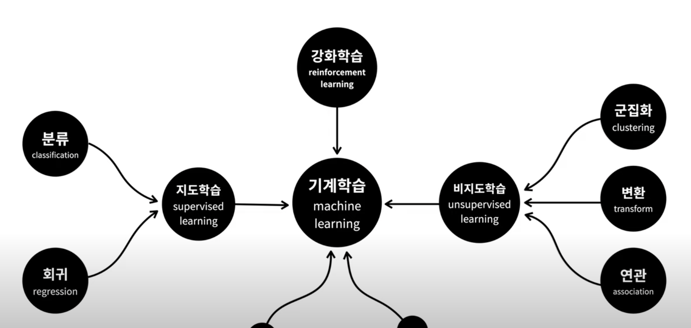

## 🖥️ Machine Learning_Python  

 

- Learn and Practice Machine Learning on Jupyter Notebook environment
- NumPy and Pandas are popular libraries in Python for data manipulation and analysis

 

### Numpy 
- ndarray : shape | reshape | indexing | slicing

 

### Pandas 
-  mutual conversion between different types of data(numpy ndarray, list, dictionary <-> DataFrame).

 

### Scikit-Learn 

 
